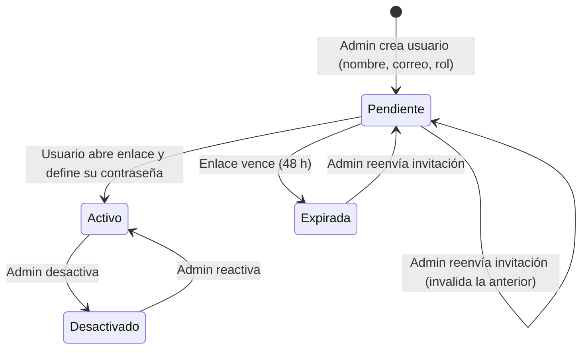
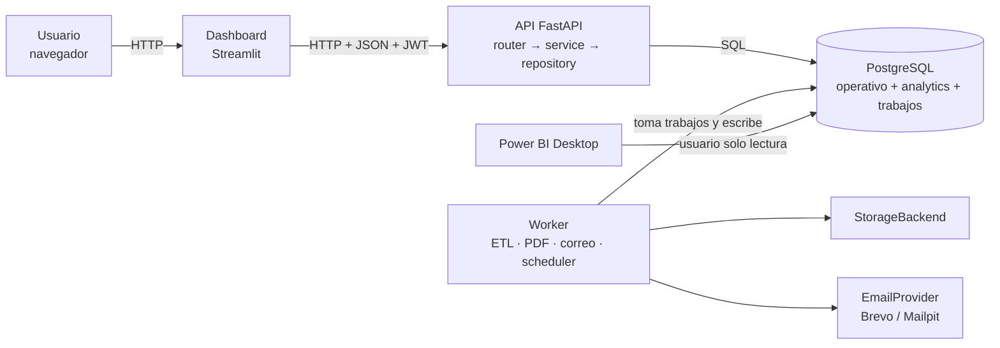
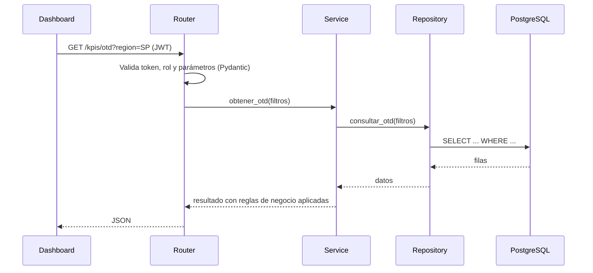
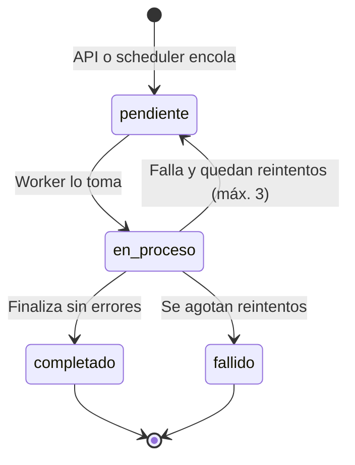
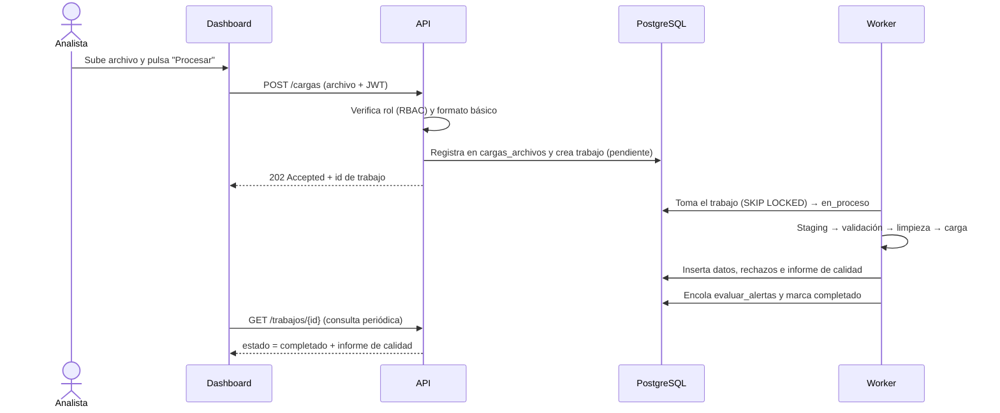

# OpsLedger — Torre de Control Operativa con Reportes Auditables

> **Estado:** Borrador v0.3 (fase de definición)
> **Tipo:** Proyecto de portafolio — Analítica de datos / BI / Backend
> **Enfoque:** Agnóstico de sector. Aplicable a ventas, retail, logística, marketing y operaciones. El dataset real elegido es solo el caso de demostración.

### Cambios de v0.2 a v0.3
- Se define formalmente el **estilo arquitectónico** (sección 8): monolito modular en capas, worker, cola en PostgreSQL y eventos internos.
- Se añaden diagramas de contenedores y de secuencia, estructura de código por módulos y un **registro de decisiones (ADR)**.
- La carga de datos y la generación de reportes pasan a ser **asíncronas** (tabla `trabajos`).
- Se añaden requisitos no funcionales de arquitectura (RNF-23 a RNF-28).
- La hoja de ruta se ajusta para construir primero el ETL como módulo invocable por línea de comandos.

### Cambios de v0.1 a v0.2
- Se elimina el enfoque portuario: el sistema es genérico y el dominio es intercambiable.
- Se adoptan **datos reales públicos** (con su suciedad) en lugar de datos simulados.
- Se añade una **capa de análisis para Power BI** como complemento.
- Se redefine el **almacenamiento de PDFs** con alternativas gratuitas y durables.
- Se añade **envío de reportes por correo** (Brevo).
- Se redefine el **alta de usuarios** por invitación, sin que el administrador conozca contraseñas.

---

## 1. Resumen del proyecto

**OpsLedger** centraliza datos transaccionales de una operación (pedidos, entregas, costos, ventas), calcula indicadores clave (KPIs), los presenta en un dashboard interactivo, detecta desviaciones mediante alertas y genera reportes ejecutivos en PDF que quedan archivados de forma **inmutable**, con sello de tiempo y huella digital (hash) verificable. Los reportes pueden además enviarse por correo y los datos pueden consumirse desde **Power BI**.

## 2. Problema del que parte

En muchas áreas de ventas, operaciones, retail y logística ocurre lo siguiente:

1. **Los problemas se detectan tarde:** retrasos, caídas de servicio o sobrecostos se ven cuando el daño ya está hecho.
2. **Los reportes se arman a mano** en Excel, con versiones distintas según quién los prepare.
3. **No hay trazabilidad:** un reporte entregado puede reemplazarse o editarse sin dejar rastro, lo que es un riesgo de control interno.
4. **Los datos reales llegan sucios:** nulos, duplicados, formatos inconsistentes, fechas incoherentes.

## 3. Propuesta de valor

| Para quién | Qué resuelve | Beneficio |
|---|---|---|
| Gerencia y jefaturas | Visibilidad en un solo panel y alertas tempranas | Decisiones más rápidas |
| Analistas | Automatiza limpieza, KPIs y reportes | Menos trabajo manual |
| Control interno / auditoría | Historial de reportes verificable | Evidencia confiable |
| Equipos que usan Power BI | Modelo de datos limpio y listo para conectar | Reutilización del trabajo |

**Diferenciadores:** reportes con integridad verificable (SHA-256 encadenado), tratamiento de datos reales con informe de calidad y compatibilidad con Power BI.

## 4. Objetivos

**General:** construir un sistema de punta a punta que convierta datos operativos reales en información accionable y deje evidencia auditable de cada reporte emitido.

**Específicos:**
- Ingestar, limpiar y normalizar un dataset público real, documentando los problemas encontrados.
- Calcular 8 KPIs operativos y comerciales.
- Mostrar un dashboard con filtros dinámicos y alertas por umbral.
- Generar reportes PDF semanales/mensuales de forma automática y enviarlos por correo.
- Garantizar inmutabilidad y verificación de integridad.
- Exponer una capa analítica consumible desde Power BI.
- Controlar accesos con RBAC y alta de usuarios por invitación.

---

## 5. Estrategia de datos

### 5.1 Dataset principal (propuesto): Olist — E-commerce brasileño
Datos reales anonimizados de ~100 mil pedidos (2016-2018), publicados en Kaggle. Incluye:
- Pedidos con fechas de compra, aprobación, envío, entrega real y entrega estimada.
- Ítems con precio y flete, vendedores, productos y categorías.
- Pagos, clientes, ubicación (estado/ciudad) y reseñas con puntaje.

**Por qué sirve:** cubre ventas, logística, marketing (satisfacción) y retail, y contiene los problemas reales que hacen creíble el ETL (nulos, fechas inconsistentes, pedidos cancelados, traducciones de categorías, etc.).

> **Pendiente:** verificar la licencia vigente del dataset antes de publicar el repositorio.

### 5.2 Dataset opcional de contraste
Un segundo dataset público (por ejemplo, vuelos, viajes en taxi o servicios 311) para demostrar que el sistema se adapta cambiando la configuración, no el código. Se incluye solo si el tiempo lo permite.

### 5.3 Diseño para ser agnóstico de sector
- Modelo interno genérico: **transacción** (fecha, entidad, categoría, región, monto, duración, estado).
- Un archivo de **configuración por dataset** (mapeo de columnas, definición de KPIs, umbrales).
- La interfaz usa términos genéricos (entidad, región, categoría) que la configuración traduce (vendedor, estado, categoría de producto).

### 5.4 Modo reproducción
Como los datos son históricos, el sistema los carga por lotes semanales en orden cronológico para **simular operación continua**: así el scheduler, las alertas y los cierres de periodo se prueban de forma realista y se genera un historial de reportes de varios meses.

### 5.5 Informe de calidad de datos
Cada carga produce un resumen: registros leídos, aceptados, corregidos y rechazados, con el motivo. Es parte del producto y evidencia cómo se trató la suciedad real.

---

## 6. Alcance

### Dentro del alcance (MVP)
- Carga de datos por archivo y por lotes programados.
- Pipeline ETL con validaciones e informe de calidad.
- Base relacional con modelo operativo y capa analítica (esquema estrella).
- API REST con autenticación y RBAC.
- Dashboard web con filtros y alertas.
- Reportes PDF programados y bajo demanda, inmutables y verificables.
- Envío de reportes por correo.
- Conexión documentada a Power BI y un `.pbix` de ejemplo.
- Gestión de usuarios por invitación.

### Fuera del alcance (por ahora)
- Integración en tiempo real con sistemas empresariales reales.
- Aplicación móvil nativa.
- Modelos predictivos (posible fase 2).
- Multiempresa (multi-tenant).
- Blockchain real (solo encadenamiento de hashes).
- Publicación en el servicio de Power BI (requiere cuenta corporativa/licencia).

---

## 7. Usuarios, roles y cuentas

### 7.1 RBAC
**RBAC (Role-Based Access Control):** los permisos se asignan a **roles**, y cada usuario hereda los del rol que tiene. Simplifica la administración y reduce errores de seguridad.

| Rol | Descripción |
|---|---|
| **Administrador** | Gestiona usuarios, roles y configuración (umbrales, programación). No ve contraseñas. |
| **Analista** | Carga datos, explora el dashboard, genera reportes manuales y exporta datos. |
| **Gerente** | Consulta dashboard, alertas y reportes. Solo lectura. Puede recibir reportes por correo. |
| **Auditor** | Consulta historial, verifica integridad y revisa la bitácora. Solo lectura. |

### 7.2 Matriz de permisos

| Acción | Admin | Analista | Gerente | Auditor |
|---|:-:|:-:|:-:|:-:|
| Gestionar usuarios y roles | ✅ | ❌ | ❌ | ❌ |
| Configurar umbrales y programación | ✅ | ❌ | ❌ | ❌ |
| Cargar datos | ✅ | ✅ | ❌ | ❌ |
| Ver dashboard y alertas | ✅ | ✅ | ✅ | ✅ |
| Exportar datos (CSV / capa Power BI) | ✅ | ✅ | ❌ | ❌ |
| Generar reporte manual | ✅ | ✅ | ❌ | ❌ |
| Consultar y descargar reportes | ✅ | ✅ | ✅ | ✅ |
| Verificar integridad | ✅ | ✅ | ❌ | ✅ |
| Ver bitácora | ✅ | ❌ | ❌ | ✅ |
| **Modificar o eliminar reportes** | ❌ | ❌ | ❌ | ❌ |

### 7.3 Ciclo de vida de una cuenta (sin registro público)
No hay registro abierto: es un sistema interno, por lo que las cuentas las crea un administrador. El administrador **nunca conoce ni define contraseñas**.



**Reglas del enlace de activación / recuperación:**
- Token aleatorio criptográficamente seguro; en la base se guarda **solo su hash**.
- **Un solo uso** y con **vencimiento** (activación: 48 h; recuperación: 15 min).
- Al reenviar, el token anterior queda invalidado.
- Respuestas neutras en recuperación (no revelan si el correo existe).
- Límite de intentos por IP/correo.
- Ninguna contraseña viaja por correo ni se registra en logs.

---

## 8. Arquitectura

### 8.1 Decisión arquitectónica

**Monolito modular en capas, con un worker en segundo plano y eventos internos simples.**

Una arquitectura se decide en tres niveles independientes:

| Nivel | Pregunta | Decisión en OpsLedger |
|---|---|---|
| **Despliegue** | ¿Cuántos programas independientes forman el sistema? | Un backend (monolito modular) + dashboard + worker + base de datos |
| **Organización interna** | ¿Cómo se ordena el código? | Capas: router → service → repository, agrupadas por módulos de dominio |
| **Comunicación** | ¿Cómo se hablan las partes? | Síncrona (HTTP) para consultar; asíncrona (cola en PostgreSQL) para tareas pesadas; eventos internos para encadenar procesos |

### 8.2 Vista de contenedores



| Contenedor | Responsabilidad | Regla clave |
|---|---|---|
| `dashboard` | Presentación (Streamlit) | **Nunca consulta la base directamente**; solo habla con la API |
| `api` | Reglas de negocio, RBAC, KPIs, endpoints | Único punto de entrada a los datos para usuarios |
| `worker` | ETL, generación de PDF, correos, scheduler | Ejecuta lo lento fuera de la petición HTTP |
| `db` | PostgreSQL 16 | Triggers de inmutabilidad y permisos por rol de base de datos |
| `mailpit` (solo desarrollo) | Bandeja local de correo | Evita gastar cuota de Brevo |

### 8.3 Organización interna: capas

En una API con front separado, las ideas de MVC se reparten así:

| MVC | En OpsLedger |
|---|---|
| Vista | Dashboard Streamlit |
| Controlador | **Router** de FastAPI: recibe la petición, valida con Pydantic, verifica token y rol |
| Modelo | **Service** (reglas de negocio) + **Repository** (consultas SQL) + entidades |

**Regla de dependencia:** el router llama al service y el service llama al repository; nunca al revés. Un router no contiene SQL ni reglas de negocio, y un repository no conoce HTTP.



### 8.4 Comunicación síncrona y asíncrona

- **Síncrona (el usuario espera):** login, consultar dashboard, descargar reporte, listar historial.
- **Asíncrona (se encola):** carga de datasets, generación de PDF, envío de correos, evaluación de alertas. Si se hicieran dentro de la petición HTTP, la pantalla se congelaría o daría timeout.

**Cola de trabajos en PostgreSQL.** La tabla `trabajos` actúa como cola; el worker toma trabajos con `SELECT ... FOR UPDATE SKIP LOCKED`, lo que evita que dos workers tomen el mismo trabajo sin necesidad de Redis ni RabbitMQ.



Tipos de trabajo: `procesar_carga`, `evaluar_alertas`, `generar_reporte`, `enviar_correos`. Cada uno debe ser **idempotente** (ejecutarlo dos veces no duplica resultados).

### 8.5 Eventos internos

Hay una cadena natural de eventos de negocio, implementada encadenando trabajos en la misma cola:

```
carga_completada  →  evaluar_alertas  →  alerta_creada  →  notificación
cierre_de_periodo →  generar_reporte  →  reporte_generado → enviar_correos
```

### 8.6 Flujos principales

**Carga de datos (asíncrona):**



**Reporte inmutable (programado):**

```mermaid
sequenceDiagram
    participant S as Scheduler (en worker)
    participant W as Worker
    participant P as PostgreSQL
    participant ST as StorageBackend
    participant M as EmailProvider
    S->>P: Encola generar_reporte al cierre del periodo
    W->>P: Toma el trabajo y consulta KPIs y alertas
    W->>W: Renderiza plantilla y genera el PDF
    W->>W: Calcula SHA-256 y obtiene hash del reporte anterior
    W->>ST: Guarda el archivo
    W->>P: INSERT en reportes (transacción; trigger bloquea UPDATE/DELETE)
    W->>P: Encola enviar_correos
    W->>M: Envía enlace seguro a los suscriptores
```

### 8.7 Estructura de código (por módulos de dominio)

```
OpsLedger/
├── docs/                      # documentación y registros de decisión
├── data/raw/                  # CSV originales (no se versionan)
├── scripts/                   # utilidades puntuales (exploración, etc.)
├── src/
│   ├── core/                  # configuración, seguridad, conexión a BD, logging
│   ├── modules/
│   │   ├── auth/              # login, tokens, RBAC
│   │   ├── usuarios/          # invitaciones, roles
│   │   ├── ingesta/           # ETL, validaciones, rechazos, calidad
│   │   ├── kpis/              # fórmulas y consultas
│   │   ├── alertas/           # reglas y evaluación
│   │   ├── reportes/          # PDF, hash, verificación
│   │   ├── notificaciones/    # EmailProvider y plantillas
│   │   └── auditoria/         # bitácora
│   │       # cada módulo: router.py · service.py · repository.py · schemas.py
│   ├── worker/                # consumidor de trabajos y scheduler
│   └── dashboard/             # aplicación Streamlit
├── migrations/                # Alembic
├── tests/
├── docker-compose.yml
├── .env.example
└── README.md
```

### 8.8 Stack tecnológico

| Capa | Herramienta | Justificación |
|---|---|---|
| Lenguaje | Python 3.12 | Ecosistema de datos |
| ETL | Pandas / Polars | Limpieza y KPIs |
| Base de datos | PostgreSQL 16 | Triggers, roles, permisos, vistas, cola de trabajos |
| API | FastAPI + Pydantic | Tipada, rápida, documentación OpenAPI |
| ORM / migraciones | SQLAlchemy + Alembic | Control de versiones del esquema |
| Dashboard | Streamlit + Plotly | Desarrollo ágil e interactividad |
| BI complementario | Power BI Desktop | Requisito frecuente en empleos |
| PDF | WeasyPrint + Jinja2 | Diseño con HTML/CSS |
| Tareas programadas | APScheduler (dentro del worker) | Cierres de periodo |
| Correo | Brevo (API o SMTP) | Capa gratuita; Mailpit en desarrollo |
| Autenticación | JWT + argon2/bcrypt | Seguridad |
| Contenedores | Docker + Compose | Reproducibilidad |
| Pruebas / CI | Pytest + GitHub Actions | Calidad |

### 8.9 Capa analítica para Power BI
- Esquema `analytics` con tablas de hechos y dimensiones (fecha, entidad, región, categoría). Funciona como **modelo de lectura** separado del modelo operativo de escritura (CQRS ligero).
- Vistas de KPIs ya calculadas.
- Rol de base de datos **de solo lectura** para Power BI.
- Entregables: guía de conexión, archivo `.pbix` de ejemplo y capturas.
- Alcance de aprendizaje acotado: modelo, relaciones y unas 10 medidas DAX.

> Importante: los dashboards de Streamlit no se "exportan" a Power BI. Ambos consumen la misma capa analítica.

### 8.10 Registro de decisiones arquitectónicas (ADR)

| ID | Decisión | Alternativas descartadas | Justificación | Costo asumido |
|---|---|---|---|---|
| ADR-01 | Monolito modular | Microservicios | Un desarrollador, dominio acotado; los microservicios añaden red, versionado y despliegues sin beneficio | Menor escalado independiente de módulos |
| ADR-02 | Capas router → service → repository por módulo | Código plano por tipo de archivo; arquitectura hexagonal completa | Separación clara de responsabilidades con poca ceremonia | Algo de código repetitivo |
| ADR-03 | Cola de trabajos en PostgreSQL | Kafka, RabbitMQ, Celery + Redis | Volumen bajo; reduce infraestructura y permite transacciones junto con los datos | Menor rendimiento que un broker dedicado |
| ADR-04 | Worker separado de la API | Ejecutar tareas dentro de la API | La API responde rápido y las tareas largas no bloquean al usuario | Un contenedor más |
| ADR-05 | Dashboard solo vía API | Streamlit con acceso directo a la BD | RBAC y reglas aplicadas en un único lugar | Una capa HTTP adicional |
| ADR-06 | Puertos y adaptadores en almacenamiento y correo | Código atado a un proveedor | Permite cambiar de R2 a `bytea` o de Brevo a otro sin tocar los services | Interfaces adicionales |
| ADR-07 | Esquema `analytics` separado | Consultar tablas operativas directamente | Modelo estable para dashboard y Power BI; facilita el rendimiento | Mantener vistas/tablas derivadas |
| ADR-08 | Streamlit como cliente | Front SPA (React) | Rapidez de desarrollo; el valor está en datos y backend | Menor control de UX y de sesión; el front podría reemplazarse porque la API ya está desacoplada |
| ADR-09 | JWT con expiración | Sesiones en servidor | API sin estado, apta para varios clientes | Revocación más compleja |
| ADR-10 | Eventos internos como trabajos encadenados | Bus de eventos | Suficiente para el flujo de negocio actual | Sin suscriptores arbitrarios |
| ADR-11 | PostgreSQL nativo en desarrollo local | Docker Compose en desarrollo local | Evita la sobrecarga de contenedores en la máquina de desarrollo. `docker-compose.yml` y Dockerfiles se reservan solo para el despliegue y se validan en CI (no en local). | Los Dockerfiles y contenedores no se prueban localmente en cada cambio, sino en el pipeline de CI. |

> **Frase para entrevista:** "Elegí un monolito modular porque el equipo es uno y el dominio está acotado; aislé lo pesado en un worker y dejé interfaces para poder extraer módulos a servicios si algún día hace falta."

### 8.11 Entorno de desarrollo local y despliegue

En desarrollo local se utiliza **PostgreSQL 16 nativo** (ejecutándose en `localhost:5432`) para evitar la sobrecarga de contenedores en la máquina de desarrollo. La conexión a la base de datos se realiza de forma exclusiva mediante la variable de entorno `DATABASE_URL` configurada en `.env`.

El archivo `docker-compose.yml` y los Dockerfiles correspondientes se mantienen exclusivamente como **referencia de despliegue** para entornos de producción/staging. La validación de los Dockerfiles y contenedores se realiza dentro del pipeline de integración continua (CI) en GitHub Actions, y no en el entorno local.

---

## 9. Inmutabilidad de reportes (núcleo del proyecto)

1. Al generar el PDF se calcula su **SHA-256**.
2. Se registra en la tabla `reportes`: id (UUID), periodo, tipo, ubicación del archivo, hash, **hash del reporte anterior** (encadenamiento), fecha y generador.
3. **Trigger en PostgreSQL** que rechaza `UPDATE` y `DELETE` sobre `reportes`.
4. El usuario de base de datos de la aplicación **no tiene permisos** de actualización ni borrado sobre esa tabla.
5. Función de **verificación**: recalcula el hash del archivo y valida la cadena completa.
6. Cualquier alteración o archivo faltante se marca, genera alerta crítica y queda en bitácora.
7. Las correcciones se hacen emitiendo **un reporte nuevo** que referencia al anterior; nunca se reemplaza.

## 10. Estrategia de almacenamiento de PDFs

Se define una interfaz `StorageBackend` con implementaciones intercambiables:

| Opción | Ventajas | Desventajas |
|---|---|---|
| Disco local (volumen Docker) | Simple, ideal en desarrollo | Se pierde si se destruye el entorno |
| **PostgreSQL (`bytea`)** | Un solo respaldo; el trigger protege también el archivo | Crece la base; poco adecuado para archivos muy grandes |
| **Cloudflare R2 / Backblaze B2** | Compatibles con S3, capa gratuita (verificar condiciones vigentes), durabilidad | Requiere configuración y cuenta |
| AWS S3 | Estándar de industria | Costo y complejidad poco justificados para el portafolio |

**Recomendación inicial:** local en desarrollo y R2/B2 (o `bytea`) en la demo. El hash en la base detecta pérdida o alteración sin importar el backend.

## 11. Correo electrónico (Brevo)

Usos:
1. Invitación de activación de cuenta.
2. Recuperación de contraseña.
3. Entrega de reportes a suscriptores.
4. Notificación de alertas críticas (opcional).

Decisiones:
- Los reportes se notifican con **enlace seguro al historial** (requiere login) en lugar de adjuntar el PDF, por confidencialidad. El adjunto queda como opción configurable.
- Interfaz `EmailProvider` para cambiar de proveedor sin tocar la lógica.
- Mailpit/MailHog en desarrollo para no consumir cuota.
- Verificación del remitente en Brevo para mejorar la entregabilidad.

---

## 12. Requisitos no funcionales (RNF)

| ID | Categoría | Requisito |
|---|---|---|
| RNF-01 | Rendimiento | Consultas del dashboard en **≤ 3 s** con ~100 mil pedidos y filtros combinados. |
| RNF-02 | Rendimiento | Generación de un reporte PDF en **≤ 60 s**. |
| RNF-03 | Seguridad | Contraseñas con hash seguro (argon2/bcrypt); nunca en texto plano ni en logs. |
| RNF-04 | Seguridad | Autenticación JWT con expiración; comunicación por HTTPS. |
| RNF-05 | Seguridad | RBAC aplicado en la API, no solo en la interfaz. |
| RNF-06 | Seguridad | Tokens de activación/recuperación: aleatorios, hasheados en base, de un solo uso y con vencimiento. |
| RNF-07 | Confidencialidad | Credenciales y claves en variables de entorno; enlaces de reporte protegidos por login. |
| RNF-08 | Integridad | Reportes no modificables ni eliminables; integridad verificable. |
| RNF-09 | Auditoría | Toda acción relevante queda en bitácora. |
| RNF-10 | Disponibilidad | Despliegue reproducible con Docker. |
| RNF-11 | Respaldo | Respaldo periódico de base de datos y archivos; el hash permite detectar pérdidas. |
| RNF-12 | Calidad de datos | Todo registro rechazado o corregido debe quedar documentado con su motivo. |
| RNF-13 | Usabilidad | Un usuario nuevo debe localizar un KPI y generar un reporte en **≤ 5 min** sin capacitación. |
| RNF-14 | Compatibilidad | Últimas 2 versiones de Chrome, Edge, Firefox y Safari. |
| RNF-15 | Compatibilidad | Interfaz responsive (escritorio y tableta, mínimo 1024 px). |
| RNF-16 | Accesibilidad | Lo esencial de **WCAG 2.1 AA**: contraste, etiquetas, teclado, paletas aptas para daltonismo, alertas no dependientes solo del color. |
| RNF-17 | Interoperabilidad | La capa analítica debe ser consumible desde Power BI mediante conector PostgreSQL con usuario de solo lectura. |
| RNF-18 | Mantenibilidad | Código modular, tipado y documentado; cobertura ≥ 70 % en lógica de KPIs y ETL. |
| RNF-19 | Portabilidad | Cambiar de dataset implica cambiar configuración y mapeos, no el núcleo. |
| RNF-20 | Trazabilidad | Cada KPI debe poder rastrearse a los registros origen. |
| RNF-21 | Entregabilidad | Los correos deben enviarse desde un remitente verificado y con plantillas probadas. |
| RNF-22 | Localización | Interfaz y reportes en español; fechas y números en formato local. |
| RNF-23 | Arquitectura | Separación en capas: los routers no contienen SQL ni reglas de negocio; las dependencias van router → service → repository. |
| RNF-24 | Arquitectura | El dashboard accede a los datos únicamente mediante la API; el único acceso directo a la base permitido es el de Power BI con usuario de solo lectura. |
| RNF-25 | Rendimiento | Toda tarea que supere ~5 s (ETL, PDF, correos) se ejecuta en el worker; la API responde en ≤ 1 s con el id del trabajo. |
| RNF-26 | Resiliencia | Los trabajos tienen estado, hasta 3 reintentos, registro del error y son idempotentes. |
| RNF-27 | Observabilidad | Logs estructurados con identificador de petición/trabajo y endpoint `/health`. |
| RNF-28 | Extensibilidad | Un nuevo proveedor de almacenamiento o correo se añade implementando la interfaz, sin modificar los services. |

---

## 13. Requisitos funcionales (RF)

### Seguridad y usuarios
- **RF-01** Iniciar sesión con correo y contraseña.
- **RF-02** Cerrar sesión y expirar por inactividad.
- **RF-03** Crear usuario (nombre, correo, rol) por el administrador, en estado *pendiente*.
- **RF-04** Enviar invitación por correo con enlace de activación de un solo uso y con vencimiento.
- **RF-05** Activar cuenta definiendo contraseña propia desde el enlace.
- **RF-06** Reenviar invitación invalidando la anterior.
- **RF-07** Recuperar contraseña mediante enlace temporal.
- **RF-08** Editar, desactivar y reactivar usuarios; cambiar rol.
- **RF-09** Restringir funciones según el rol (RBAC).

### Datos (ETL)
- **RF-10** Cargar archivos CSV/Excel del dataset.
- **RF-11** Validar estructura, tipos, rangos y coherencia (ej. entrega antes de la compra).
- **RF-12** Limpiar y normalizar (duplicados, nulos, formatos, categorías).
- **RF-13** Mostrar informe de calidad de la carga y guardar rechazos con motivo.
- **RF-14** Ejecutar ingesta por lotes programados (modo reproducción).
- **RF-15** Configurar el mapeo de columnas y KPIs por dataset.

### KPIs y dashboard
- **RF-16** Calcular los KPIs definidos (sección 14).
- **RF-17** Mostrar tendencias, comparativos y mapas de calor.
- **RF-18** Filtrar por rango de fechas, región, categoría, entidad y estado.
- **RF-19** Navegar de un KPI agregado al detalle de registros (drill-down).
- **RF-20** Exportar la vista actual a CSV.
- **RF-21** Exponer capa analítica y vistas para Power BI.

### Alertas
- **RF-22** Definir umbrales por KPI con severidad.
- **RF-23** Evaluar umbrales tras cada carga y mostrar alertas.
- **RF-24** Incluir las alertas del periodo en el reporte PDF.

### Reportes inmutables
- **RF-25** Generar reportes automáticos al cierre de semana/mes.
- **RF-26** Generar reportes manuales para un periodo.
- **RF-27** Asignar identificador único, sello de tiempo y hash SHA-256.
- **RF-28** Guardar el archivo mediante `StorageBackend` y registrarlo en la tabla de reportes.
- **RF-29** Bloquear toda modificación o eliminación.
- **RF-30** Consultar historial con filtros y descargar.
- **RF-31** Verificar integridad de un reporte y de toda la cadena.
- **RF-32** Suscribir usuarios a reportes y enviarlos por correo al emitirse.

### Auditoría
- **RF-33** Registrar bitácora (usuario, acción, fecha, resultado, IP).
- **RF-34** Consultar y filtrar la bitácora.

---

## 14. KPIs propuestos (con dataset Olist)

| KPI | Definición | Decisión que permite |
|---|---|---|
| **Tiempo de ciclo del pedido** | Entrega al cliente − fecha de compra (días) | Detectar lentitud en la cadena |
| **Cumplimiento de entrega (OTD)** | % de pedidos entregados en o antes de la fecha estimada | Medir nivel de servicio |
| **Desviación de plazo** | Entrega real − estimada (días) | Dimensionar la gravedad de retrasos |
| **Tiempo de despacho del vendedor** | Entrega al transportista − aprobación | Identificar vendedores lentos |
| **Costo logístico relativo** | Flete / valor de los productos | Control de costos por región o categoría |
| **Ingresos y ticket promedio** | Suma y promedio de ventas por periodo | Seguimiento comercial |
| **Tasa de cancelación** | % de pedidos cancelados o no entregados | Detectar pérdidas |
| **Satisfacción vs. retraso** | Puntaje promedio de reseñas y su relación con la desviación de plazo | Cuantificar el efecto del retraso en el cliente |

*(Opcional)* Concentración: % de ventas del top 10 de entidades.

**Ejemplos de alertas:** OTD semanal por debajo de 90 %; tiempo de ciclo más de 20 % sobre la media móvil de 30 días; costo logístico relativo en una región por encima de su histórico.

---

## 15. Historias de usuario

Formato: **Como** [rol] **quiero** [acción] **para** [beneficio]. Cada historia incluye entrada, salida, flujo, alternos y requisitos vinculados.

---

### HU-01 — Iniciar sesión
**Como** usuario activo **quiero** iniciar sesión **para** acceder según mi rol.

- **Entrada:** correo y contraseña.
- **Salida:** sesión iniciada y vista inicial según rol; o mensaje de error genérico.
- **Flujo:**
  1. El usuario abre la aplicación y el sistema muestra el formulario de login.
  2. Ingresa correo y contraseña y hace clic en "Ingresar".
  3. El sistema valida formato y verifica credenciales.
  4. Genera el token, registra el acceso en bitácora y redirige al dashboard.
- **Alternos:** credenciales incorrectas → "Correo o contraseña incorrectos"; 5 intentos fallidos → bloqueo temporal; cuenta pendiente o desactivada → acceso denegado.
- **Requisitos:** RF-01, RF-02, RF-09, RNF-03, RNF-04, RNF-09.

### HU-02 — Activar cuenta por invitación
**Como** empleado invitado **quiero** definir mi propia contraseña desde un enlace **para** activar mi cuenta sin que nadie más la conozca.

- **Entrada:** enlace con token; nueva contraseña y su confirmación.
- **Salida:** cuenta *activa* y redirección al login.
- **Flujo:**
  1. El empleado recibe el correo de invitación y hace clic en el enlace.
  2. El sistema valida que el token exista, no haya sido usado ni esté vencido.
  3. Muestra el formulario "Define tu contraseña".
  4. El empleado completa los campos y hace clic en "Activar cuenta".
  5. El sistema valida la política de contraseña, la guarda cifrada, marca el token como usado y la cuenta como activa.
  6. Muestra "Cuenta activada correctamente" y redirige al login.
- **Alternos:** token vencido o ya usado → mensaje y aviso de pedir una nueva invitación al administrador.
- **Requisitos:** RF-05, RNF-03, RNF-06, RNF-09.

### HU-03 — Recuperar contraseña
**Como** usuario **quiero** restablecer mi contraseña **para** recuperar el acceso si la olvidé.

- **Entrada:** correo; luego nueva contraseña.
- **Salida:** correo con enlace temporal; contraseña actualizada.
- **Flujo:**
  1. En el login, el usuario hace clic en "¿Olvidaste tu contraseña?".
  2. El sistema muestra el formulario para ingresar el correo.
  3. El usuario lo envía y el sistema responde con un mensaje neutro ("Si el correo existe, recibirás instrucciones").
  4. Si la cuenta existe y está activa, se envía un enlace de un solo uso con vigencia de 15 min.
  5. El usuario define la nueva contraseña; el sistema la guarda, invalida el enlace y las sesiones anteriores, y redirige al login.
- **Requisitos:** RF-07, RNF-06, RNF-03, RNF-21.

### HU-04 — Gestionar usuarios
**Como** administrador **quiero** crear, invitar, desactivar usuarios y asignar roles **para** controlar el acceso sin conocer sus contraseñas.

- **Entrada:** nombre, correo, rol.
- **Salida:** usuario en estado *pendiente*; invitación enviada; confirmación en pantalla.
- **Flujo:**
  1. El administrador abre el módulo "Usuarios" y el sistema lista las cuentas con rol y estado.
  2. Hace clic en "Nuevo usuario" y completa el formulario.
  3. El sistema valida (correo único, rol válido), crea la cuenta en estado *pendiente* y genera el token.
  4. Envía el correo de invitación, registra la acción en bitácora y muestra "Invitación enviada correctamente".
- **Alternos:** correo duplicado → error; invitación vencida → opción "Reenviar" que invalida la anterior; el admin no puede desactivarse a sí mismo.
- **Requisitos:** RF-03, RF-04, RF-06, RF-08, RF-09, RNF-05, RNF-06.

### HU-05 — Cargar datos y revisar su calidad
**Como** analista **quiero** cargar un dataset y ver su informe de calidad **para** confiar en los indicadores.

- **Entrada:** archivos CSV/Excel y configuración del dataset.
- **Salida:** resumen (leídos, aceptados, corregidos, rechazados) y archivo descargable de rechazos.
- **Flujo:**
  1. El analista abre "Carga de datos" y selecciona dataset y archivo.
  2. Hace clic en "Procesar"; la API verifica el rol, registra la carga, crea un trabajo y responde de inmediato "Carga recibida".
  3. El worker toma el trabajo y valida estructura, tipos y coherencia.
  4. Limpia y normaliza los registros válidos y los inserta.
  5. Los inválidos pasan a la tabla de rechazos con su motivo.
  6. El dashboard muestra el estado ("procesando…" → "completado") y, al terminar, el informe de calidad; el sistema lo registra en bitácora y encola la evaluación de alertas.
- **Alternos:** columnas faltantes → carga cancelada con detalle; archivo ya cargado (mismo hash) → advertencia.
- **Requisitos:** RF-10 a RF-15, RF-23, RNF-12, RNF-20.

### HU-06 — Explorar el dashboard con filtros
**Como** gerente **quiero** ver KPIs y filtrarlos por periodo, región, categoría y entidad **para** identificar dónde están los problemas.

- **Entrada:** rango de fechas, región, categoría, entidad, estado.
- **Salida:** tarjetas de KPIs, tendencias y mapa de calor actualizados.
- **Flujo:**
  1. El gerente inicia sesión y ve el último periodo por defecto.
  2. Ajusta uno o más filtros.
  3. El sistema recalcula y actualiza todos los componentes en ≤ 3 s.
  4. Al hacer clic en un punto del gráfico, el sistema muestra el detalle de los registros.
- **Alternos:** sin datos → "No hay datos para los filtros seleccionados".
- **Requisitos:** RF-16 a RF-19, RNF-01, RNF-13 a RNF-16.

### HU-07 — Configurar umbrales de alerta
**Como** administrador **quiero** definir umbrales por KPI **para** recibir avisos ante desviaciones.

- **Entrada:** KPI, condición, severidad.
- **Salida:** regla guardada y activa.
- **Flujo:** abre "Alertas" → elige KPI → define condición y severidad → guarda → el sistema valida y confirma.
- **Requisitos:** RF-22, RNF-09.

### HU-08 — Ver alertas tempranas
**Como** gerente **quiero** ver las alertas activas **para** actuar antes de que el problema escale.

- **Entrada:** opcional, filtro por severidad.
- **Salida:** lista con KPI afectado, valor actual, umbral, fecha y severidad (con icono y texto, no solo color).
- **Flujo:** tras cada ingesta el sistema evalúa las reglas → genera las alertas → las muestra en el panel superior del dashboard.
- **Requisitos:** RF-23, RNF-16.

### HU-09 — Generación automática de reporte inmutable
**Como** sistema **quiero** generar el reporte al cierre de cada semana/mes **para** dejar evidencia periódica sin intervención manual.

- **Entrada:** periodo, plantilla, KPIs y alertas del periodo.
- **Salida:** PDF almacenado + registro inmutable (id, hash, hash anterior, sello de tiempo) y notificación a suscriptores.
- **Flujo:**
  1. El scheduler del worker encola un trabajo `generar_reporte` al cierre del periodo y el worker lo toma.
  2. El sistema consulta KPIs y alertas.
  3. Renderiza la plantilla y genera el PDF.
  4. Calcula SHA-256 y obtiene el hash del reporte anterior.
  5. Guarda el archivo mediante `StorageBackend`.
  6. Inserta el registro en `reportes` (solo inserción) dentro de una transacción.
  7. Registra en bitácora y dispara el envío por correo (HU-13).
- **Alternos:** si falla, reintenta y registra el error; no queda registro parcial.
- **Requisitos:** RF-24, RF-25, RF-27 a RF-29, RNF-02, RNF-08.

### HU-10 — Generar reporte manual
**Como** analista **quiero** generar un reporte de un periodo concreto **para** atender solicitudes puntuales.

- **Entrada:** fecha inicio, fecha fin, tipo de reporte.
- **Salida:** PDF inmutable con identificador y hash; enlace de descarga.
- **Flujo:** "Reportes" → "Nuevo reporte" → selecciona periodo y tipo → "Generar" → mismo proceso de HU-09 → "Reporte generado correctamente".
- **Nota:** un reporte emitido no se reemplaza; las correcciones generan uno nuevo que referencia al anterior.
- **Requisitos:** RF-26 a RF-29.

### HU-11 — Consultar y descargar historial
**Como** gerente o auditor **quiero** consultar los reportes emitidos **para** revisar el seguimiento histórico.

- **Entrada:** filtros por periodo, tipo y fecha de emisión.
- **Salida:** tabla paginada (ID, periodo, fecha, hash abreviado, estado de verificación) y descarga.
- **Flujo:** "Historial" → filtros → lista → "Descargar" → el sistema entrega el archivo y registra la descarga.
- **Criterio clave:** la interfaz no ofrece opciones de editar ni eliminar.
- **Requisitos:** RF-29, RF-30, RNF-09.

### HU-12 — Verificar integridad
**Como** auditor **quiero** comprobar que un reporte no fue alterado **para** garantizar su validez como evidencia.

- **Entrada:** un reporte, o "verificar toda la cadena".
- **Salida:** ✅ íntegro / ❌ alterado, con hash esperado vs. calculado y el primer eslabón roto.
- **Flujo:**
  1. El auditor selecciona un reporte y hace clic en "Verificar integridad".
  2. El sistema recalcula el SHA-256 del archivo.
  3. Compara con el hash registrado y con el encadenamiento previo.
  4. Muestra el resultado y lo registra en bitácora.
- **Alternos:** archivo no encontrado → estado "faltante" y alerta crítica.
- **Requisitos:** RF-31, RNF-08, RNF-09.

### HU-13 — Recibir reportes por correo
**Como** gerente **quiero** suscribirme a los reportes **para** recibirlos al emitirse sin entrar al sistema a buscarlos.

- **Entrada:** suscripción (tipo de reporte, frecuencia).
- **Salida:** correo con resumen de KPIs y enlace seguro al reporte en el historial.
- **Flujo:**
  1. El gerente abre "Mis suscripciones" y activa los reportes deseados.
  2. Cuando se emite un reporte, el sistema envía el correo mediante Brevo.
  3. El gerente hace clic en el enlace, inicia sesión y descarga el PDF.
  4. El envío se registra en bitácora.
- **Alternos:** error de envío → reintento y registro del fallo, sin afectar la emisión del reporte.
- **Requisitos:** RF-32, RNF-07, RNF-21.

### HU-14 — Conectar y exportar datos para Power BI
**Como** analista **quiero** acceder a la capa analítica desde Power BI **para** construir informes propios con datos ya limpios.

- **Entrada:** credenciales del usuario de solo lectura y parámetros de conexión (según la guía).
- **Salida:** modelo cargado en Power BI Desktop con relaciones y medidas; alternativamente, exportación CSV.
- **Flujo:**
  1. El analista consulta la guía de conexión.
  2. En Power BI Desktop elige el conector PostgreSQL e ingresa servidor y credenciales.
  3. Selecciona las tablas y vistas del esquema `analytics`.
  4. Abre el `.pbix` de ejemplo o construye sus visualizaciones.
- **Requisitos:** RF-20, RF-21, RNF-17.

### HU-15 — Consultar bitácora
**Como** auditor **quiero** revisar quién hizo qué y cuándo **para** detectar acciones sospechosas.

- **Entrada:** filtros por usuario, acción y fechas.
- **Salida:** listado de eventos exportable.
- **Requisitos:** RF-33, RF-34, RNF-09.

---

## 16. Modelo de datos preliminar

| Tabla / esquema | Propósito | Campos clave |
|---|---|---|
| `usuarios` | Cuentas | id, nombre, correo, hash_password (nulo hasta activar), rol_id, estado |
| `roles`, `permisos` | RBAC | rol_id, permiso |
| `tokens_cuenta` | Activación y recuperación | id, usuario_id, tipo, **hash_token**, expira_en, usado_en |
| `pedidos`, `items_pedido`, `pagos`, `reseñas` | Operación (dataset) | según mapeo |
| `entidades`, `regiones`, `categorias` | Dimensiones | — |
| `cargas_archivos` | Control de ingesta | id, nombre, hash, usuario, fecha, estado |
| `registros_rechazados` | Calidad de datos | id, carga_id, fila, motivo |
| `reglas_alerta`, `alertas` | Umbrales y eventos | kpi, condición, severidad / valor, fecha |
| `suscripciones` | Envío de reportes | usuario_id, tipo_reporte, activa |
| `trabajos` | Cola de tareas asíncronas | id, tipo, payload (JSON), estado, intentos, creado_por, creado_en, iniciado_en, finalizado_en, error |
| **`reportes`** | **Historial inmutable** | id (UUID), periodo, tipo, ubicación, sha256, hash_anterior, generado_en, generado_por |
| `bitacora_auditoria` | Eventos | id, usuario_id, acción, detalle, resultado, ip, fecha |
| **esquema `analytics`** | **Capa para Power BI** | hechos y dimensiones, vistas de KPIs |

---

## 17. Hoja de ruta sugerida

| Fase | Contenido | Resultado |
|---|---|---|
| **0. Definición** | Documento, arquitectura y decisiones (ADR) | Alcance y arquitectura cerrados |
| **1. Datos** | Esqueleto del proyecto, exploración del dataset, esquema, ETL invocable por línea de comandos, informe de calidad | Base poblada y documentada |
| **2. KPIs, API y worker** | Cálculo de KPIs, FastAPI en capas, autenticación, RBAC, invitaciones, tabla `trabajos` y worker (el ETL pasa a ejecutarse como trabajo) | Backend funcional |
| **3. Dashboard y alertas** | Filtros, gráficos, umbrales | Panel interactivo |
| **4. Reportes inmutables** | PDF, hash, triggers, verificación, scheduler, correo | Núcleo del proyecto |
| **5. Capa Power BI** | Esquema `analytics`, `.pbix`, guía | Complemento de BI |
| **6. Calidad y entrega** | Pruebas, Docker, CI, README, video demo | Portafolio listo |

## 18. Riesgos

| Riesgo | Mitigación |
|---|---|
| Datos reales demasiado desordenados o pesados | Empezar con un subconjunto y documentar cada regla de limpieza |
| Dataset antiguo (2016-2018) | Modo reproducción; declararlo con claridad en el README |
| Curva de aprendizaje de Power BI | Limitar a modelo, relaciones y ~10 medidas DAX |
| Límites de capas gratuitas (correo, almacenamiento) | Interfaces intercambiables; local y Mailpit en desarrollo |
| Correos que caen en spam | Remitente verificado y plantillas sencillas |
| Alcance excesivo | MVP primero; predictivo y segundo dataset como extras |
| Inmutabilidad superficial | Triggers + permisos + hash encadenado + prueba que intente borrar |
| KPIs mal explicados en entrevista | Documentar fórmula y decisión asociada de cada KPI |

## 19. Entregables de portafolio

- Repositorio con README, diagrama de arquitectura y declaración del dataset usado.
- PDFs de ejemplo generados (varios periodos).
- Capturas del dashboard y del `.pbix`, y video demo de 2 a 3 minutos.
- Script/prueba que demuestre el rechazo de un intento de modificar o borrar un reporte.
- Guía de conexión a Power BI.
- Esta documentación (`/docs`).

## 20. Decisiones

### Cerradas
- ✅ Sistema **agnóstico de sector**; el dataset es solo la demostración.
- ✅ **Datos reales públicos**, no simulados (candidato principal: Olist).
- ✅ **Sin registro público**; alta por invitación con enlace temporal y de un solo uso.
- ✅ Power BI como **complemento** mediante capa analítica, no como exportación del dashboard.
- ✅ Correo mediante **Brevo**, con enlace seguro como forma principal de entrega.
- ✅ **Monolito modular en capas** con worker, cola en PostgreSQL y eventos internos (ver ADR en sección 8.10).
- ✅ El dashboard consume **solo la API**; nunca la base de datos.

### Pendientes
- [ ] Confirmar dataset (y licencia) tras explorarlo.
- [ ] Elegir almacenamiento de demo: R2/B2 o `bytea`.
- [ ] Definir si se incluye un segundo dataset de contraste.
- [ ] Decidir el hosting de la demo (o solo Docker + video).
- [ ] Definir si las alertas críticas también se envían por correo.

---

*Documento vivo: se actualizará al cerrar las decisiones pendientes.*
