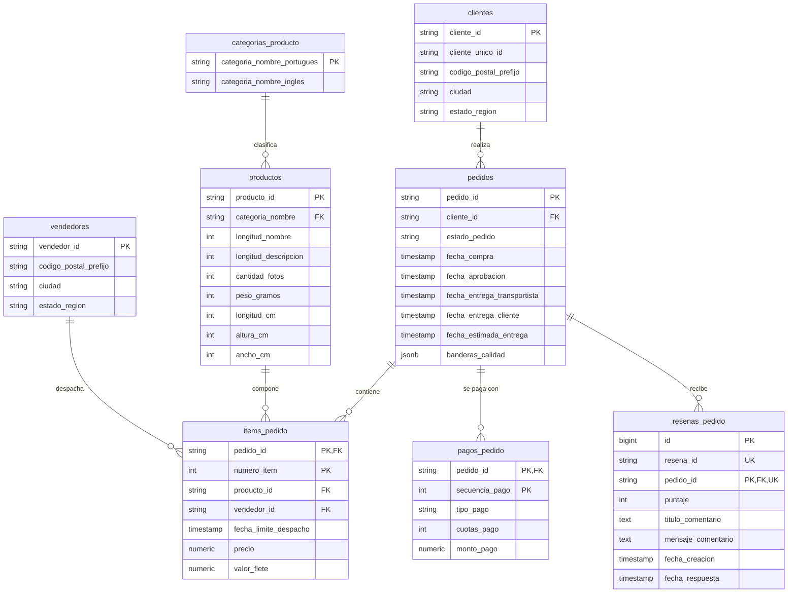

# Modelo de Datos e Infraestructura de Esquemas (OpsLedger)

## 1. Esquemas de Base de Datos PostgreSQL

El sistema OpsLedger organiza los datos en los siguientes esquemas:

- `staging`: Copia cruda e inalterada de los archivos CSV de entrada. Todas las columnas se almacenan como `TEXT` con metadatos de ingesta (`carga_id` UUID, `numero_fila` BIGINT) para garantizar que la carga cruda no falle por formato o tipo. Las filas procesadas exitosamente se vacían de `staging` tras la ingesta a `operativo`. Los códigos postales se leen y almacenan siempre como texto (`VARCHAR(10)` / `TEXT`) para preservar los ceros a la izquierda (ej. `'07729'`, `'08980'`).
- `calidad`: Trazabilidad de cargas (`cargas_archivos`) con hash SHA-256 parcial para idempotencia y registro de anomalías e inconsistencias duras (`registros_rechazados`).
- `operativo`: Modelo relacional normalizado en 3FN con tipos de datos nativos, marcas de tiempo sin zona horaria (`TIMESTAMP WITHOUT TIME ZONE`), claves primarias y foráneas con política `ON DELETE RESTRICT`, restricciones `CHECK` e índices optimizados para el dashboard.
- `analytics` (Fase 2): Modelo estrella con tablas de hechos y dimensiones (`dim_fechas`, `dim_clientes`, `dim_vendedores`, `dim_productos`, `dim_geografia`, `fact_pedidos`, `fact_items`) para el consumo de Power BI y Streamlit.
- `app` / `sistema` (Fase 2): Esquema reservado para las tablas de control de la aplicación (`usuarios`, `roles`, `permisos`, `tokens_cuenta`, `trabajos`, `reportes`, `bitacora_auditoria`).

---

## 2. Diagrama Entidad-Relación (Esquema Operativo)

---

## 3. Justificación de Claves Primarias, Unicidad y Políticas ON DELETE

| Tabla | Clave Primaria / Restricción Única | Justificación Empírica (Dataset Olist) |
|---|---|---|
| `operativo.clientes` | PK `cliente_id` | 99,441 filas únicas. `cliente_id` identifica la transacción/sesión de compra. `cliente_unico_id` se mantiene como atributo indexado para analizar recurrencia. |
| `operativo.vendedores` | PK `vendedor_id` | 3,095 filas sin duplicados. |
| `operativo.categorias_producto` | PK `categoria_nombre_portugues` | Unión de las 71 categorías traducidas y las categorías adicionales presentes en la tabla de productos (`pc_gamer`, `portateis_cozinha_e_preparadores_de_alimentos`). |
| `operativo.productos` | PK `producto_id` | 32,951 filas únicas. |
| `operativo.pedidos` | PK `pedido_id` | 99,441 filas únicas. |
| `operativo.items_pedido` | PK Compuesta `(pedido_id, numero_item)` | 112,650 filas. Identifica de forma unívoca cada ítem dentro de un pedido. |
| `operativo.pagos_pedido` | PK Compuesta `(pedido_id, secuencia_pago)` | 103,886 filas. Unívoco para cada pago parcial o cuota de un pedido. |
| `operativo.resenas_pedido` | PK Surrogada `id` (BIGINT IDENTITY) + **UNIQUE `(resena_id, pedido_id)`** | **Verificación empírica:** Existen 98,410 `resena_id` únicos en 99,224 filas, pero la pareja `(resena_id, pedido_id)` es 100% única (0 duplicados). La restricción UNIQUE habilita `ON CONFLICT (resena_id, pedido_id) DO NOTHING` idempotente. |

### Política de Claves Foráneas: `ON DELETE RESTRICT`
Todas las claves foráneas hacia `calidad.cargas_archivos` (desde `registros_rechazados`) y hacia `operativo.pedidos` (desde `items_pedido`, `pagos_pedido` y `resenas_pedido`) emplean `ON DELETE RESTRICT` en lugar de `CASCADE`.
- **Justificación de auditoría:** OpsLedger es una torre de control operativa y auditable. Borrar un lote de carga o un pedido no debe eliminar silenciosamente sus registros de rechazo de calidad, ítems o pagos. La política `RESTRICT` exige la eliminación explícita controlada o bloquea el borrado si existen entidades dependientes, garantizando la trazabilidad.

---

## 4. Orden de Carga e Idempotencia

### Orden de Carga por Dependencia de Claves Foráneas:
1. `operativo.categorias_producto`
2. `operativo.clientes`
3. `operativo.vendedores`
4. `operativo.productos` (depende de `categorias_producto`)
5. `operativo.pedidos` (depende de `clientes`)
6. `operativo.items_pedido` (depende de `pedidos`, `productos`, `vendedores`)
7. `operativo.pagos_pedido` (depende de `pedidos`)
8. `operativo.resenas_pedido` (depende de `pedidos`)

### Idempotencia y Transaccionalidad:
- **Control de Ingesta:** `calidad.cargas_archivos` almacena el hash SHA-256 del archivo. Se incluye un índice único parcial `CREATE UNIQUE INDEX idx_cargas_hash_completado ON calidad.cargas_archivos (hash_sha256) WHERE estado = 'completado';`. Si se re-ejecuta un archivo ya procesado exitosamente, la carga se omite.
- **Inserción Incremental:** Todas las sentencias de inserción a `operativo` ejecutan `INSERT ... ON CONFLICT (...) DO NOTHING` (o `DO UPDATE`), garantizando que re-procesar o cargar lotes no genere violaciones de clave ni duplicados.
- **Transacción Atómica:** La migración de datos de `staging` a `operativo`, el registro de rechazados en `calidad` y la actualización del estado del lote a `'completado'` se ejecutan dentro de una única transacción atómica de base de datos.
- **Limpieza de Staging:** Al finalizar con éxito la transacción, las filas correspondientes al lote procesado son eliminadas de `staging`. Se conservan en `staging` únicamente si la carga falla.

---

## 5. Reglas de Calidad de Datos (Clasificación de Hallazgos)

Toda violación de restricciones de integridad de base de datos (`NOT NULL`, `FK`, `CHECK`) constituye un **Error Duro** que envía la fila a `calidad.registros_rechazados`. Las inconsistencias de negocio o datos faltantes en campos opcionales constituyen **Inconsistencias Blandas** que ingresan a `operativo` marcando banderas de calidad.

| Hallazgo / Anomalía | Filas Afectadas | Nivel de Calidad | Acción y Justificación |
|---|---|---|---|
| **Violación de NOT NULL, FK o CHECK** | Variable | **Error Duro** | La fila se rechaza a `calidad.registros_rechazados` almacenando `motivo_rechazo`, `numero_fila` y `datos_crudos` (JSONB). |
| **Categoría no traducida al inglés** (`pc_gamer`, `portateis_cozinha...`) | 13 productos | **Blando** | Se ingresa la categoría en `categorias_producto` con `categoria_nombre_ingles = NULL`. El producto se carga en `operativo.productos` e informa la falta de traducción en el reporte de calidad. |
| **Producto sin categoría o sin metadata** | 610 productos (1.85%) | **Blando** | Se carga el producto en `operativo.productos` con `categoria_nombre = NULL`. Excluir el producto rompería los 112,650 ítems de pedido asociados. |
| **Producto sin peso/dimensiones** | 2 productos (0.01%) | **Blando** | Se carga en `operativo.productos` con atributos nulos. Se aísla únicamente de reportes de cubaje o peso logístico estricto. |
| **Pedido `delivered` sin fecha de entrega al cliente** | 8 pedidos (0.01%) | **Blando** | Se inserta en `operativo.pedidos` con `banderas_calidad = {"sin_fecha_entrega_cliente": true}`. Se excluye de los KPIs de tiempo de ciclo u OTD, pero se conserva para facturación. |
| **Pedido `delivered` sin fecha de aprobación** | 14 pedidos (0.01%) | **Blando** | Se inserta en `operativo.pedidos` con `banderas_calidad = {"sin_fecha_aprobacion": true}`. Se aísla del cálculo de tiempo de aprobación. |
| **Fecha de despacho antes de la aprobación** | 1,359 pedidos (1.37%) | **Blando** | Inconsistencia de sellos de tiempo del sistema de origen. Se inserta registrando la bandera de calidad. Se incluye en OTD final pero se aísla al medir tiempo de despacho del vendedor. |
| **Entrega al cliente antes del transportista** | 23 pedidos (0.02%) | **Blando** | Inconsistencia de orden de sellos. Se inserta marcando la bandera. |
| **Estado no `delivered` con fecha de entrega** | 6 pedidos (0.01%) | **Blando** | Inconsistencia de estado. Se carga registrando la bandera. |
| **Reseñas con título/mensaje nulo** | 87,656 títulos (88.34%) | **Esperable (Blando)** | Nulos opcionales por comportamiento del usuario (calificación solo por estrellas). Se cargan normalmente en `operativo.resenas_pedido`. |

---

## 6. Organización de Esquemas de Aplicación para Fase 2

En la Fase 2, las tablas de soporte y seguridad de la aplicación se ubicarán en el esquema `app`:
- `app.usuarios`: Cuentas de usuario.
- `app.roles`, `app.permisos`: Control de accesos RBAC.
- `app.tokens_cuenta`: Enlaces temporales de invitación y recuperación.
- `app.trabajos`: Cola asíncrona procesada con `SELECT ... FOR UPDATE SKIP LOCKED`.
- `app.reportes`: Historial inmutable de PDFs con sello SHA-256 encadenado y triggers de bloqueo.
- `app.bitacora_auditoria`: Registro de eventos del sistema.
